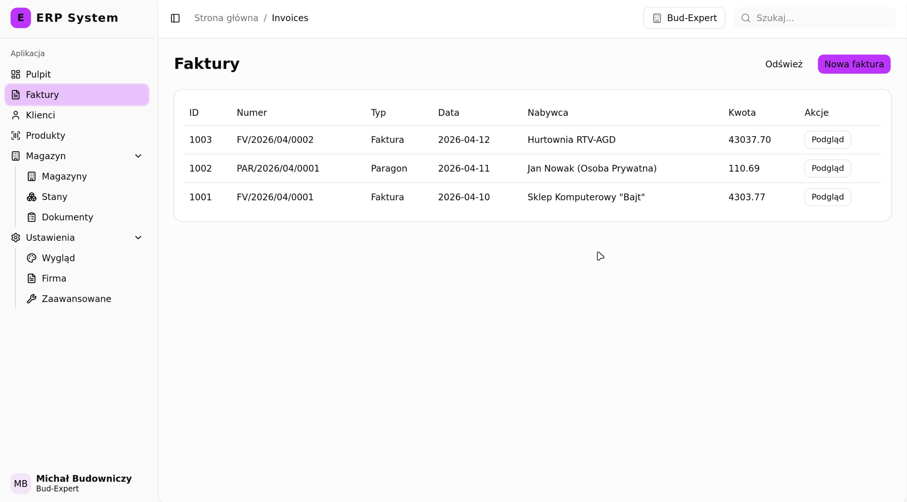
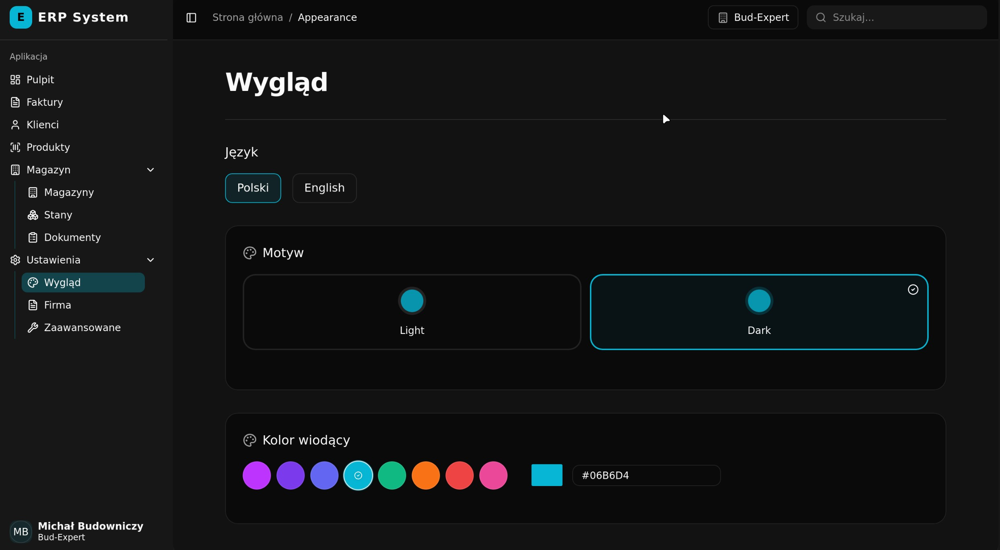

# ERP

Prosty, darmowy i otwartoźródłowy system ERP dla małych i średnich przedsiębiorstw.

> [!WARNING]  
> ⚠️ Projekt jest obecnie w fazie aktywnego rozwoju i tworzenia

Celem projektu jest dostarczenie wszystkich kluczowych funkcji potrzebnych do prowadzenia małej firmy, pozbywając się przy tym zbędnego chaosu, przeładowania interfejsu i złożoności znanej z tradycyjnego, ciężkiego oprogramowania dla korporacji.

